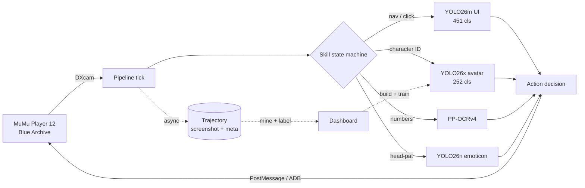

# Blue Archive Daily Assistant

**它是什么**:一个在你自己电脑上运行的《蔚蓝档案》AI 助手。它像人一样"看"模拟器画面(AI 视觉识别按钮和角色),像人一样点击操作——每天自动帮你收咖啡厅、扫荡关卡、打竞技场、领邮件和任务奖励,新活动还能自动推图、按加成规划体力。不改游戏、不上云,纯本地。

**铁律**:绝不花你的青辉石或真钱——所有涉及货币的操作都有多层拦截,读不出余额就宁可不做。

**它现在能做什么**(2026-07 实测):
- ✅ 每日全套日常:收菜(免费包/社团/制造/商店/课程表/咖啡厅摸头)→ 悬赏/交流会/竞技场 → 活动优先吃光体力 → 邮件+每日任务收尾
- ✅ 新活动开荒:自动跳剧情、推 Story/Quest 关、按"活动>双倍>普通"规划体力、盘点活动商店算 farm 计划
- ✅ 实时战斗感知:18 类战斗检测(我方/敌方/5 种 Boss/胜利/HUD 全套)+ 技能卡上的角色识别(0.99 置信),为"AI 自己打战斗"打底
- 🚧 进行中:AI 控牌打战斗(行为树决策+30fps 视频流感知)、总力战抄轴(视频轴表→自动执行)

## At a Glance

| | |
|---|---|
| **Platform** | Windows 10 / 11, NVIDIA GPU |
| **Game runtime** | MuMu Player 12 |
| **Daily** | `DailyRoutine` (10 sub-skills) + event planner + sweep chain |
| **Vision** | YOLO26m UI (484-cls) + YOLO26x avatar (252-cls) + YOLO26s battle (18-cls) + YOLO26n emoticon |
| **OCR** | PP-OCRv4 fine-tuned on BA glyphs — numeric fields only |
| **Battle** | ByteTrack lock (ally idsw -66%) + skill-card ID + card-play (behavior tree, WIP) |
| **Tooling** | Annotation dashboard (class mgmt / video→frames→prefill / timeline sheets) |

## How It Works



## Vision Stack

| Tier | Model | Job | Latency |
|---|---|---|---|
| **UI** (primary) | YOLO26m `ui_v8` (469-cls) | every button / tab / popup / badge → drives all nav + clicks; in-game flywheel-trained | ~6 ms |
| Avatar ID | YOLO26x `fused_avatar_v6` (252-cls) | bbox + character ID in one pass + in-battle skill-card recognition (incl. grayed-out / charging) | ~10 ms |
| Numeric OCR | PP-OCRv4 BA-tuned | AP / ticket / count digits only | ~50 ms |
| Head-pat | YOLO26n `emoticon` | cafe head-pat bubble | ~2 ms |
| Battle | YOLO26s `battle_v9` (18-cls) | ally / enemy / 5 boss forms / victory / full HUD — trained on emulator runs **+ community strategy videos** (download→frames→track-prefill→human review flywheel) | ~12 ms |

Active versions are resolved at runtime from `data/model_registry.json`, so shipping a model is a one-line `active` bump — and rolling back is just as fast. Each detector infers at its training `imgsz` (960 for the UI / avatar models). `cv2.matchTemplate` / HSV survive as cheap fallbacks for a few stable glyphs.

**Why pure-YOLO (OCR demoted):** the pipeline used to navigate by OCR text + template match, which broke on font rendering, localization and resolution. Disabling OCR for navigation forced every click path through a trained class — navigation is now resolution- and scale-independent, and a miss is an honest "class not detected" instead of a silent mis-click.

## Daily Skills

`DailyRoutine` runs ten sub-skills in order; each finds its target by class and clicks the returned box. Money paths are gated **structurally** (right column), never by trust in a single detection.

| # | Skill | Does | Money / fallback guard |
|---|---|---|---|
| 1 | BuyPyroxene | claim daily free pack | confirm **only if `免费` present**, else cancel |
| 2 | Club | check-in for AP | card miss → red-dot offset |
| 3 | Craft | claim + queue craft | "finish-now" ticket dialog → cancel |
| 4 | Shop | affordable credit buys | bail if pyroxene tab; buy only if balance ≥ reserve |
| 5 | Cafe | income / invite / head-pat | NAV miss → bottom-bar extrapolation |
| 6 | Schedule | lesson dispatch, favorite-first | ticket OCR=0 → exit; pyroxene in dialog → cancel |
| 7 | MomoTalk | clear unread bond chats | — |
| 8 | StoryMining | mine unplayed story nodes | battle node (SORTIE/SQUAD) → back, spend no AP |
| 9 | Mail | claim all rewards | entry clicked only from lobby |
| 10 | DailyMission | claim dailies (runs last) | unlocked only after the rest finish |

`CampaignSweep` enters the mission hub once and delegates to bounty / arena (+ event when active). Global popups (rewards, level-up, exit / disconnect dialogs) are dismissed once in the pipeline interceptor by class — a backable modal via 取消 / X, never ESC (ESC could confirm the exit-game dialog).

## Battle Lock

A Kalman **predict → correct** tracker over YOLOv8n head detections, rendered to a Win32 layered overlay. Three things give it the external-grade feel:

- **One-Euro smoothing** — heavy when the target is slow (no jitter), light when fast (no lag).
- **Predictive lead-aim** — the box is drawn where the target *will* be (`position + velocity × end-to-end latency`), hiding the ~30–50 ms capture→render lag. Clamped so a noisy velocity spike can't fling it; off by default for static UI overlays.
- **Velocity coast + ByteTrack rescue** — an unmatched track glides on its decayed velocity through a VFX flash that tanks confidence; the low-conf second stage re-acquires the moment the head reappears.

## Dashboard

A FastAPI + WebView2 app for running the bot and iterating models:

- **Agent / HUD** — profile, skill order, AP / favorites, dry-run toggle; live pipeline state (current skill, sub-state, last action reason).
- **Capture** — DXcam capture with split routing to `train` runs or per-purpose held-out val pools, so rare-class samples are never stolen from training.
- **Annotate** — YOLO / OCR labeling hardened for long sessions: 50-step undo/redo, cross-frame paste, LRU prefetch for 0-latency paging, loss-proof saves, find-by-class, and model-assisted prefill (`YOLO预填` overlays the active model on a whole run so weak classes get their first samples).
- **Synth Templates** — visual per-context slot editor (axis-aligned rect or free 4-point quad), ref-crop preview, augmentation anchors, bbox modes, live preview — the heart of avatar / skill-card data generation.
- **Trajectories** — per-tick replay (screenshot, OCR, YOLO, action, reason).

## Models & Iteration

What actually moved the needle, learned across UI v1→v5 and avatar v1→v4:

- **Spatial augmentation** (mosaic / copy_paste / scale / translate / hsv_v) breaks position- and background-dependence — the core fix for the early overfit where a handful of frames blown up ~200× by oversample made the model memorize backgrounds instead of elements.
- **`fliplr / flipud / degrees = 0`** for UI — left/right is semantic (左切换 ↔ 右切换); flipping corrupts labels.
- **mixup / copy_paste are toxic for fine-grained 252-class ID** — they blend identity features; removed for the avatar model.
- **Synthetic compositing** pastes a rare element / character onto hundreds of real backgrounds — diversity that duplication cannot provide.
- **The small held-out val lies** — it carried zero instances of the weak classes it was meant to measure, and picked the wrong checkpoint. Models ship from a frozen `last.pt` after a real-frame check, not from val-mAP alone.
- **Warm-start** from the previous best preserves learned identity features and roughly halves wall-clock.

**Active:** UI `ui_yolo26m_v8` · avatar `fused_avatar_yolo26x_v6` · emoticon `v26n` · battle `battle_heads`.

**UI v8** (shipped) grows the class map to **469** — adding the full batch-sweep dialog suite (批量扫荡 button/start/plan/equipment states) hand-labeled by the operator — and fixes the two long-standing weak spots: red/yellow notification-dot **cross-confusion 348 → 0** (a position-prior poisoning in teacher labels, cured by per-pixel HSV arbitration over 635 labels at the source) and the double/triple-event ribbon **0.03 → 0.51**. Micro-precision 0.993 on the 515-frame all-real val. Shipped from a 14-epoch arrow-rehearsal finetune (`v8b`), checkpoint picked by real-val peak with a full per-class regression scan against v7 — which surfaced one honest lesson: the val set's lobby arrows all wore a since-replaced memorial-lobby skin, so the headline arrow recall reads 0.06 on a dead domain while live frames from the last four days score 90%. Skin-dependent UI elements get synthetic-compositing insurance in the next cycle.

**UI v7** (previous) was the first pure-UI flywheel retrain: by-class recall 0.83 → 0.92 on the real 477-frame val, craft-entry 0→0.97. Kept in the registry — rollback is a one-line `active` flip.

**Avatar v6** (shipped) extends the 252-head detector to in-battle **EX skill cards** — the bottom-row character cards, including the grayed-out *insufficient-cost* state with its clock-wipe charge sweep — built from a template-synth pipeline with multi-background backgrounds and domain-accurate gray/sector augmentation. On held-out real frames: skill-card recall **0.85** (vs the prior cards-capable run's 0.56) while non-battle recognition (cafe / formation) holds at mAP50 **0.99**. The shipped checkpoint is the *real-val peak*, picked on a manual val set rather than the synth-inflated nominal best (later epochs overfit the synthetic cards).

**In progress:**

- **Batch-sweep skill** — the v8 dialog classes get their real acceptance test as a live skill walk (MAX → sweep → claim).
- **Synthetic arrow hardening** — skin-dependent elements (lobby arrows et al.) composited over diverse backgrounds so the next lobby-skin change can't break them.
- **Battle skill-card AI** — the detector now *sees* the cards (incl. gray/charging); a combat policy that *reads* them (cost-aware skill rotation) is the next layer. (The unified single-model path is parked: per-domain specialists keep winning on measurement.)

## Quick Start

### Requirements

Windows 10/11 · Python 3.11+ · [MuMu Player 12](https://mumu.163.com/) running Blue Archive · NVIDIA GPU (RTX 3060+ for the battle lock; the daily pipeline is CPU-bound).

### Install

```powershell
git clone https://github.com/C0k11/blue-archive-assistant.git
cd blue-archive-assistant
pip install -r requirements.txt
```

### Run

```powershell
# Launcher (recommended): download GameSecretaryApp.exe from Releases and double-click.
# Terminal:
py -m uvicorn server.app:app --host 127.0.0.1 --port 8000
# then open http://127.0.0.1:8000/dashboard.html

# Battle-lock demo (--lead-ms ≈ end-to-end latency to predict ahead):
py scripts/battle_overlay_demo.py --fps 240 --conf 0.05 --lead-ms 40
```

### Train / iterate a model

Build data in the dashboard (Capture + Annotate), then:

```powershell
py scripts/build_fused_avatar_dataset.py        # avatar / skill-card dataset (synth + manual + neg)
py scripts/train_yolo26.py fused_avatar_26x_v4  # train a registered config
py scripts/eval_fused_avatar_report.py          # per-frame HTML eval
# ship: freeze weights, bump the active version in data/model_registry.json
```

## Repository Layout

```
ai-game-secretary/
├── brain/
│   ├── pipeline.py          # interceptors, model-registry resolve, async trajectory writer
│   └── skills/              # one module per skill
├── vision/                  # OCR, avatar matcher, YOLO wrappers
├── server/                  # FastAPI app + dashboard.html
├── scripts/                 # train / build / eval / battle-overlay
│   ├── train_yolo26.py
│   ├── build_fused_avatar_dataset.py
│   ├── build_ui_v2.py
│   ├── battle_overlay_demo.py
│   └── ocr_training/
├── data/
│   ├── model_registry.json  # active model versions (single source of truth)
│   ├── synth_templates/     # per-context synth JSON
│   ├── raw_images/          # labeled frames + _classes.txt master
│   └── captures/角色头像/   # wiki portrait refs
└── windows_app/             # .NET 8 WebView2 launcher
```

Models, datasets and the HF cache live outside the repo under `D:/Project/ml_cache/` (gitignored).

## License & Disclaimer

Personal / educational use only. No game files are redistributed; assets stay in your own MuMu installation. Not affiliated with Yostar / Nexon / Bilibili / NetEase.
