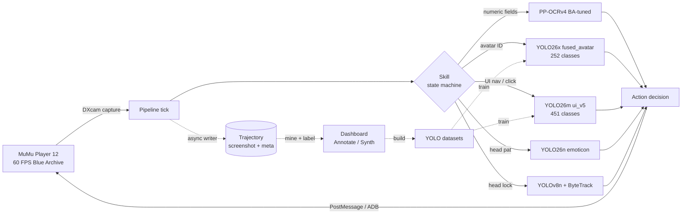
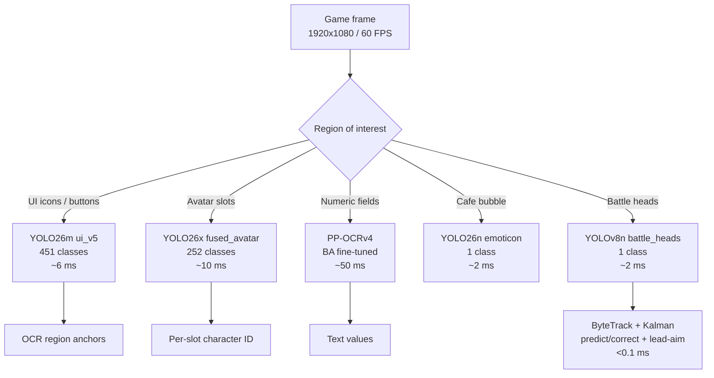
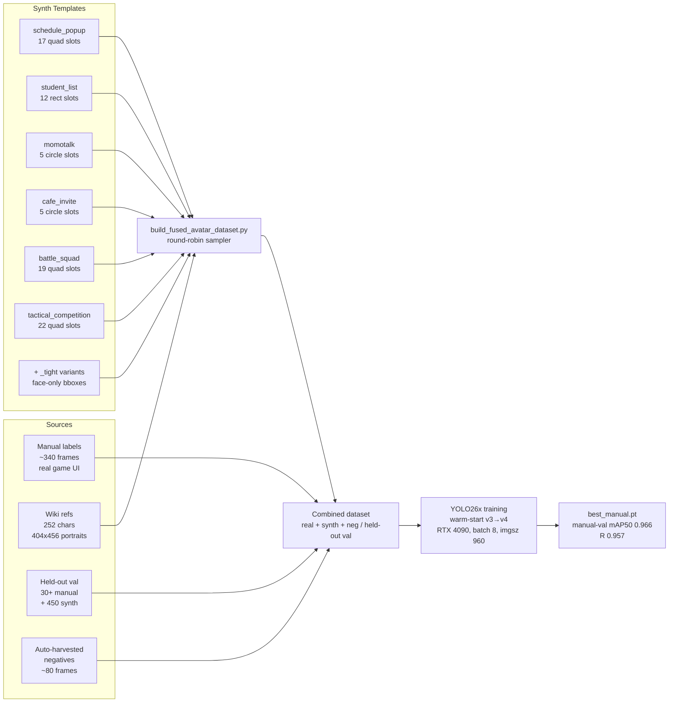
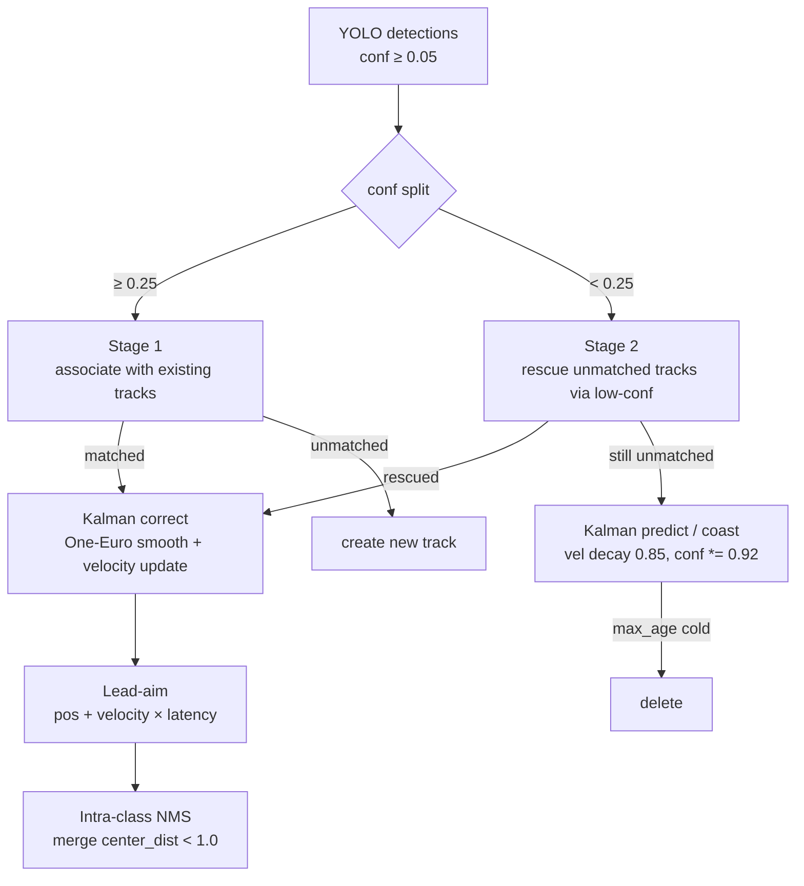
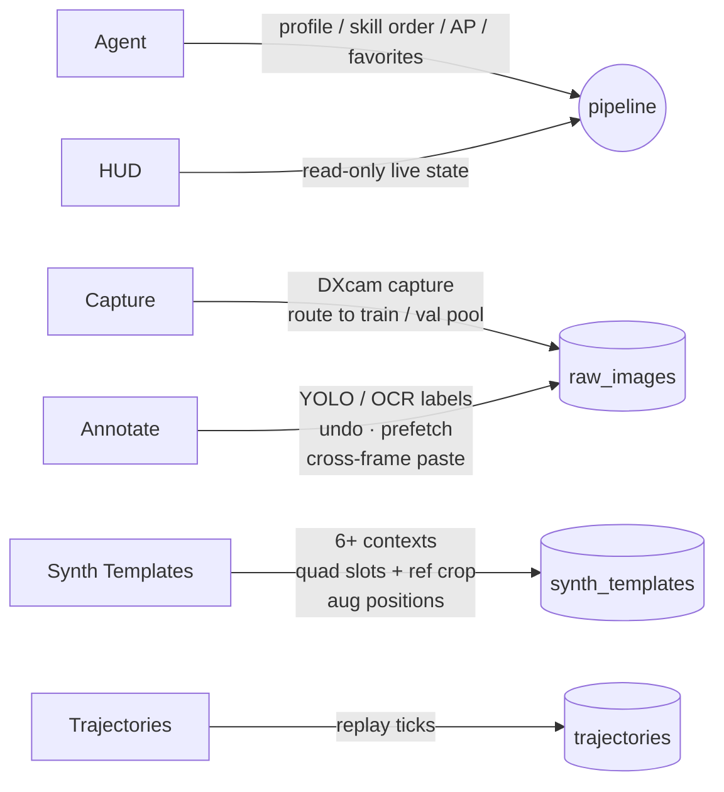

# Blue Archive Daily Assistant

Fully automated daily routine and real-time battle target lock for *Blue Archive*. Runs entirely on a local Windows machine — no cloud dependencies, no game modification.

The automation is built on a vision-first stack. **UI navigation and clicks are driven entirely by a 451-class YOLO26m UI detector** — every button, tab, popup, badge and region the bot acts on is located by a trained class, never by a hardcoded screen coordinate, so the same logic works across window sizes and desktop scaling. A 252-class **fused YOLO26 avatar detector** identifies who is at which slot in a single forward pass, OCR is reserved for reading numeric fields (AP / tickets / counts), and an explicit state machine drives the daily skills through MuMu Player 12 via DXcam capture + PostMessage / ADB input. A Windows-native WebView2 launcher and a feature-rich annotation dashboard make data collection and model iteration first-class workflows.

---

## At a Glance

| | |
|---|---|
| **Platform** | Windows 10 / 11, NVIDIA GPU recommended (RTX 3060+) |
| **Game runtime** | MuMu Player 12 (60 FPS cap) |
| **Daily skills** | 2 meta-skills orchestrating ~15 sub-skills, ordered, dry-runnable |
| **Vision tier** | YOLO26m (451-class UI) + YOLO26x (252-class avatar) + YOLO26n (emoticon) + YOLOv8n (battle head) |
| **UI detection** | `ui_yolo26m_v5` — pure-YOLO navigation, no hardcoded click positions; ≈99.5% real-frame hit rate |
| **OCR** | PP-OCRv4 fine-tuned on BA glyphs (+20 pp vocab); scoped to numeric fields |
| **Battle lock** | 60-240 Hz DXcam + ByteTrack + Kalman predict-correct (lead-aim + One-Euro) |
| **Annotation** | Dashboard with synth template editor, val cleanup tool, eval HTML report |

---

## System Overview



---

## Highlights

- **One-call daily routine** — two meta-skills (`DailyRoutine` + `CampaignSweep`) orchestrate the full harvest: lobby cleanup, cafe (income / invite / head-pat), schedule with favorite priority, club, MomoTalk, shop, crafting, story mining, mail, daily tasks, pass rewards, bounty, arena, AP planning, campaign push. Each sub-skill is still runnable standalone from the dashboard skill list.
- **Fused multi-class avatar detector (YOLO26x)** — single forward pass produces bbox + character ID across 252 classes and 6 UI contexts (schedule popup, student list, momotalk, cafe invite, battle squad, tactical competition). Replaces the older 2-stage `head_detector → avatar_cls` path.
- **Dashboard synthetic template editor** — a full visual tool to configure synth data per UI context: draw axis-aligned rect or free 4-point quad slots, interactive ref crop with slot-overlay preview, four draggable colored markers for augmentation anchor positions (Lv / star / weapon / heart), tight-face vs full bbox modes, per-context augmentation probabilities, one-click sample image swap (drag-drop or path), and live preview render with zoom + pan modal.
- **Round-robin synthesis** — the build script draws characters from a per-context shuffled pool, so every character appears in every context the configured number of times (no rare-class starvation).
- **OCR fine-tuned for BA** — PP-OCRv4 base re-trained on game crops + augmented synthetic text, delivering a 20-point absolute vocabulary-accuracy gain. The output `ba_rec.onnx` loads automatically at server boot.
- **Real-time battle head lock** — DXcam capture, YOLOv8n single-class head detection, ByteTrack association + Kalman-style predict/correct tracking (One-Euro smoothing + predictive lead-aim), rendered to a Win32 layered overlay. Tuned for the 60 FPS MuMu cap.
- **Asynchronous trajectory writer** — each tick's screenshot and metadata are enqueued and flushed on a background thread, removing 10–50 ms of per-tick disk I/O from the perception loop.
- **Dedicated validation pools** — Capture page routes frames to `train` runs or to held-out `_val_<purpose>/frames/`; build scripts honor these so rare-class samples are never stolen from training. Synthetic val data is generated alongside manual val for stable mAP measurement.
- **Eval feedback loop** — per-frame HTML report with bbox overlays, wrong-class / extra-pred / miss buckets, and a `val_label_cleanup.py` helper that finds noisy GT labels by disagreement with the trained model.
- **Windows launcher** — .NET 8 + WebView2; double-click `GameSecretaryApp.exe` and the pipeline + dashboard come up.

---

## Vision Stack



| Tier | Component | Purpose | Latency |
|---|---|---|---|
| **UI primary** | **YOLO26m `ui_yolo26m_v5`** | 451-class UI: buttons / tabs / popups / badges / regions — drives all navigation + clicks | ~6 ms |
| Avatar ID | **YOLO26x `fused_avatar_yolo26x`** | 252-class joint bbox + character ID across 6 UI contexts | ~10 ms |
| Numeric OCR | PP-OCRv4 BA-tuned | AP / ticket / count digits only (text nav handed to YOLO) | ~50 ms |
| Cafe fallback | YOLO26n `emoticon_yolo26n` | Head-pat bubble when templates miss | ~2 ms |
| Battle lock | YOLOv8n `battle_heads.pt` | Single-class head detection at 60+ FPS | ~2 ms |
| Tracking | ByteTrack + Kalman | Predict/correct lock: One-Euro smoothing, velocity coast, predictive lead-aim | <0.1 ms |

UI navigation runs purely off the `ui_yolo26m_v5` detector: a skill finds its target button/tab/region by trained class and clicks the returned box — **no hardcoded screen coordinates**, so the same logic survives window-size and desktop-scaling changes. OCR is deliberately scoped to numeric fields; the avatar detector handles open-set character ID. `cv2.matchTemplate` / HSV remain as cheap fallbacks for a few stable glyphs. Battle lock stays on the smaller YOLOv8n for headroom. Active model versions are resolved at runtime from `data/model_registry.json`, so shipping a new model is a one-line `active` bump (with older versions kept for instant rollback).

---

## UI Detector — Pure-YOLO Navigation

UI detection is the backbone of the daily pipeline: `ui_yolo26m_v5` is a 451-class YOLO26m that locates every actionable element, and skills click the returned box rather than any fixed coordinate.

### Why pure-YOLO (OCR demoted)

The pipeline used to navigate by OCR text + `matchTemplate`, which broke on font rendering, localization, and resolution. The migration disabled OCR for navigation entirely (`_OCR_ENABLED=False`, kept only for digits) to force every nav/click path through a trained class — surfacing and then fixing every hidden coordinate/OCR dependency. Result: navigation is resolution- and scale-independent, and the failure mode is an honest "class not detected" rather than a silent mis-click.

### Training the detector — what actually moved the needle

Early UI models (v1–v3) detected common buttons but missed sparse elements (MomoTalk entry, daily-claim, buy-pyroxene, momotalk chat region, bond-story buttons) — a textbook **overfit**: a handful of unique frames blown up ~200× by oversample-duplication, with augmentation off, so the model memorized backgrounds instead of learning the element.

| Lever | Effect |
|---|---|
| **Spatial aug** (`mosaic`, `copy_paste`, `scale`, `translate`, `hsv_v`) | Breaks position/background dependence — the core overfit fix |
| **`fliplr/flipud/degrees = 0`** | UI has left/right semantics (左切换 ↔ 右切换); flipping corrupts labels |
| **Synthetic compositing** (`build_ui_synth.py`) | Pastes a rare element (e.g. bond-story button) onto hundreds of real backgrounds — gives diversity that duplication cannot |
| **Dedup + moderate oversample** | `build_ui_v2.py` dedupes 16157→2377 unique frames (cut 95% dup copies), then rebalances thin classes to ~30 (not 200) |
| **`close_mosaic` tail** | Last 10 epochs train on clean single frames, aligning with the eval distribution for a final accuracy bump |

### Eval discipline — the small val pool lies

The 51-frame held-out val pool contains **zero** instances of the weak classes it was meant to measure, so its mAP is blind to exactly what mattered. Two consequences became standing rules:

- **`last.pt` beat the nominal `best.pt`** on real frames — the blind val picked the wrong checkpoint. Models are shipped from a frozen `last.pt` (`best_real.pt`) after a real-frame check, not from val-mAP alone.
- The trustworthy signal is a **fresh real-capture eval** (`eval_weak_val.py` reports per-class recall on hand-labeled captures) plus **visual review in the dashboard** (`YOLO预填` overlays the live model on new frames).

### History

| Version | Arch | Data | Real-frame result |
|---|---|---|---|
| v3 | YOLO26m | OCR-relabeled lobby + oversample, aug off | weak classes (daily-claim / MomoTalk / pyroxene / chat region) at recall 0.0 |
| **v4** | YOLO26m | + 900 synth (bond) + spatial aug, from COCO | mAP50 **0.915** on 1052 real held-out frames (vs v3 0.862); weak classes 0.0 → ~1.0 |
| **v5** *(active)* | YOLO26m | warm-start from v4, ui_v2 (deduped + 1052 real + shop frames), restored cls92, +选择购买 (nc 451) | ≈99.5% real-frame hit rate; only thin region-select tiles remain (queued for v6) |

---

## Fused Avatar Detector

The 252-class fused detector is the core vision component. Training data flow:



### Synth template parameters per context

```json
{
  "context": "schedule_popup",
  "sample_image": "samples/schedule_popup.jpg",
  "image_size": [2404, 1341],
  "slot_rects_norm": [
    {"x1": 0.122, "y1": 0.358, "x2": 0.166, "y2": 0.431,
     "quad": [{"x":0.122,"y":0.358}, {"x":0.166,"y":0.358},
              {"x":0.159,"y":0.431}, {"x":0.116,"y":0.431}]}
  ],
  "ref_transform": {
    "crop_n": {"x1":0.10, "y1":0.00, "x2":0.90, "y2":0.55},
    "shape": "square",
    "scale": 1.0,
    "aug_positions": {
      "lv":     {"x": 0.05, "y": 0.15},
      "star":   {"x": 0.10, "y": 0.10},
      "weapon": {"x": 0.85, "y": 0.85},
      "heart":  {"x": 0.85, "y": 0.85}
    }
  },
  "augmentation": {
    "ui_overlay_prob": 0.5,
    "ui_components": {"lv_text":0.5,"star":0.3,"weapon_icon":0.4,"heart":0.2,"alpha_dim":0.25},
    "border_ablation_prob": 0.4
  },
  "synth_count": 297,
  "bbox_mode": "full",
  "use_for": "train"
}
```

### Training history

| Iteration | Model | Epochs | Aug profile | Notes | mAP50 (nominal) |
|---|---|---|---|---|---|
| v1 | YOLO26m | 168 (early stop) | static_ui-detected slots, no UI overlay | 113-class ref coverage | 0.597 |
| v2 | YOLO26x | 134 (early stop) | Same as v1, larger model | Capacity probe | 0.617 |
| **v3** | YOLO26x | 200 (patience=0) | **Template-driven 6 contexts**, UI overlay aug, mosaic 0.7 + mixup 0.10 + copy_paste 0.10, dropout 0.1 | **First template-editor run.** Overfit signature in epoch 130+ (val cls_loss climbed while train kept dropping). | 0.6803 (best ep124) |
| **v4** *(active)* | YOLO26x | 100 (patience 30) | Warm-start from v3 best, mosaic 0.3, **mixup 0**, **copy_paste 0**, dropout 0, lr0 0.003, +tight-face variants, +synth val | Shipped from `best_manual.pt` (ep11, picked by manual-val watcher over the synth-fitness-biased ep15 nominal best) | **0.966** manual-val / 0.957 R |

### v3 → v4 lessons baked into config

- **mixup / copy_paste are toxic for fine-grained 252-class classification.** They blend identity features and degrade val mAP even when train loss keeps falling. Removed in v4.
- **Mosaic 0.7 is too aggressive for a 60M-param model on 3.6 k train frames.** Lowered to 0.3.
- **Heavy regularization (`weight_decay=0.001`, `dropout=0.1`) does not rescue an over-augmented training distribution.** Lowered back to defaults.
- **`patience=0` ran the schedule fully but the best mAP came at ep 124; remaining 76 epochs traded peak accuracy for over-fit.** v4 uses `patience=30` so training stops once the plateau lasts that long.
- **Warm-starting from v3 `best.pt` saves ~50% wall-clock** and preserves the genuinely useful character-identity features the backbone learned.

### Evaluation discipline

`scripts/eval_fused_avatar_report.py` produces a per-frame HTML with bbox overlays sorted by recall. Recent fixes:

- **Confidence-aware GT ↔ pred matching** (was IoU-greedy; NMS-free duplicates could steal matches from the real high-conf prediction).
- **Separate wrong-class / extra-pred / miss buckets**, surfaced in `scripts/val_label_cleanup.py` so noisy manual labels can be found by model-disagreement.
- **IoU threshold defaults to 0.5** but can be lowered (`--iou-thr 0.3`) for context where pixel-perfect localization is not the goal.

A typical v3 review cycle on the 49 manual val frames surfaced ~14 cases where the model was actually correct and the manual label was wrong / missing — pushing the real recall ~10 pp above the nominal number. This is now a standard step before drawing any conclusions from a freshly trained model.

---

## Skill Matrix

All daily-skill navigation and clicks run on the `ui_yolo26m_v5` detector: a
skill finds its target (button / tab / popup / region) by trained class and
clicks the returned box — **no hardcoded screen coordinates**. OCR is scoped to
numeric reads (AP / tickets / counts); `cv2.matchTemplate` / HSV survive as a few
cheap glyph fallbacks. The pipeline ships two **meta-skills** that orchestrate
the rest so a full run is one entry instead of twenty:

| Meta-skill | Bundles | Notes |
|---|---|---|
| **DailyRoutine** | lobby cleanup → cafe → schedule → club → momotalk → shop → craft → mail → daily tasks → pass → story | One-call daily harvest; loadout `ui+cafe+battle` |
| **CampaignSweep** | bounty + arena (+ event when active) | Enters the mission hub once, scans tiles by `HUB_*` cls + red/yellow dot, delegates to each sub-skill on the hub (no lobby round-trips); sets each sub's detector loadout |

| Skill | Function | Detection stack | Notes |
|---|---|---|---|
| Cafe | Income, invitation tickets, head-pat | YOLO UI + YOLO26n emoticon | 1F left-to-right, 2F right-to-left; earnings/invite by cls |
| Schedule | Room assignment, favorite priority | YOLO UI + `fused_avatar` (student ID) | Canvas region tuner; `STAGE2_TOP_K=15` |
| Club | AP collection | YOLO UI | |
| MomoTalk | Auto-reply unread threads | YOLO UI (unread badge / chat region cls) | auto-dialog + story skip |
| Shop | Free daily + affordable buys | YOLO UI (`选择购买` / `全部选择` / 绿勾) | refresh / sold-out by cls |
| Craft | Claim finished + queue quick craft | YOLO UI | |
| StoryMining | Main / side / mini stories | YOLO UI (`new` mark, chapter / skip / menu cls) | finds unplayed chapters by cls, menu-driven skip |
| Bounty | Highest-difficulty sweep | YOLO UI (`HUB_BOUNTY`, branch cls) | rotates branches, exits on all-done |
| Arena | Reward claim + auto-battle | YOLO UI + `fused_avatar` (opponent heads) | opponent selected by avatar / `cls92` region — no fixed position |
| Mail / DailyTasks / PassReward | One-click claim | YOLO UI (claim-all / 红点 cls) | digit drain-check deferred to OCR |
| ApPlanning | Free-AP + purchase strategy | YOLO UI + OCR numeric | configurable purchase cap |
| CampaignPush | Stage sweep / fallback | YOLO UI + battle | |
| EventActivity | Event story → mission → farming | YOLO UI + battle | currently disabled in the active path |
| BattleOverlay | Live head-box lock | YOLOv8n + ByteTrack + Kalman | DXcam + Win32 overlay, lead-aim prediction, 60 FPS source |

> Global popups (rewards, level-up, exit / friend-cafe dialogs, disconnect) are
> handled once in the pipeline interceptor by cls before any skill ticks — a
> stuck backout-able modal is dismissed via 取消/X, never ESC (ESC could confirm
> the exit-game dialog).

---

## Battle Lock: ByteTrack + Kalman Predict-Correct

The lock tracker follows the Kalman **predict → correct** paradigm: each track
carries a constant-velocity motion state that is *predicted* forward every frame,
then *corrected* by the matched detection. Three things make the lock look
external-grade — smooth, latency-hiding, and occlusion-proof.



- **Kalman-style predict/correct** — a constant-velocity state per track, advanced
  by `predict()` and nudged by the matched detection. Velocity is tracked in
  units/**second** (time-aware via real `dt`), so prediction stays correct when
  detection FPS fluctuates.
- **One-Euro smoothing** (replaces fixed-alpha EMA) — the AR/VR-industry answer to
  the jitter-vs-lag tradeoff: heavy smoothing when the target is slow (no jitter),
  light smoothing when fast (no lag).
- **Predictive lead-aim** — the displayed box is drawn where the target *will* be
  (`position + velocity × end-to-end latency`), not where it was N ms ago. The lead
  is clamped so a noisy velocity spike can't fling the box. This is what hides the
  ~30–50 ms capture→infer→render→display latency and gives the lock its aimbot feel.
- **Velocity coast through occlusion** — an unmatched track keeps gliding along its
  (decayed, capped) velocity instead of freezing, so a VFX flash that tanks YOLO
  confidence is ridden through; the ByteTrack low-conf second stage re-acquires the
  moment the head reappears. Lead-aim defaults OFF for static UI overlays
  (cafe / schedule) where a stationary button must not drift.

---

## Dashboard



- **Home (Agent)** — profile switching, skill ordering, AP / event budgets, favorite-character selection, dry-run toggle.
- **HUD** — live pipeline state (current skill, sub-state, tick count, AP, last action reason).
- **Capture** — DXcam screen capture with split routing (`Train (new run_*)` vs `Val (held-out pool)`) and a Purpose selector that routes val frames to the matching pool (`Fused Avatar` → `_val_fused/`, `Static UI` → `_val_static_ui/`, `UI Weak` → `_val_weak/` for the bond/momotalk weak-class gold val). Live destination hint.
- **Annotate** — YOLO / OCR labeling workspace, hardened for long sessions:
  - Shapes: rectangles, ellipses, polygons; right-drag to draw on Windows pointer events.
  - **Undo / Redo**: `Ctrl+Z` / `Ctrl+Y` (or `Ctrl+Shift+Z`) with per-frame independent 50-step history. Snapshots at every atomic op (resize / move / rotate / vertex drag / class change / paste / Florence-add).
  - **Cross-frame paste**: `Shift+V` clones the **previous frame's** labels onto the current one (wraps around). `Shift+P` opens a picker modal — filter / arrow-keys / Enter to choose **any already-labeled frame** as the source (sorted by box count). Both go through history so `Ctrl+Z` reverts cleanly.
  - **Image cache & prefetch**: LRU cache (cap 8) keeps recent frames decoded; loading a frame triggers async prefetch of its neighbors → 0-latency `A` / `D` paging.
  - **Loss-proof saves**: `beforeunload` guard blocks reload / tab-close while edits are unsaved; `annAutoSave` `await`s the POST before navigation (race-free dirty clear via post-send re-serialization); a shared in-flight promise de-dupes concurrent `Save / Next / Ctrl+S` mashes into a single POST. Save failures surface as right-corner toasts and keep `dirty` so the next attempt re-tries.
  - **Find by class**: search box accepts class idx or name, lists every frame containing that class.
  - Dataset dropdown grouped into Validation Pools / Recordings / Trajectories.
- **Synth Templates (S)** — the heart of training data generation. Per-context visual slot editor with axis-aligned rect or free 4-point quad slots, interactive ref crop with slot-overlay preview, four draggable colored markers for augmentation anchor positions (Lv / star / weapon / heart), tight-face vs full bbox modes, per-context augmentation probabilities, fullscreen preview modal with zoom + pan + dice (random characters).
- **Trajectories** — replay of historical runs (screenshot, OCR, YOLO, action, reason) per tick.

---

## OCR Fine-Tuning

PP-OCRv4 was re-trained on Blue Archive mixed-script text (Traditional / Simplified Chinese, English, Japanese):

| Metric | Default PP-OCRv3 | BA fine-tuned | Δ |
|---|---|---|---|
| Vocabulary exact match | 35.8% | 55.8% | **+20.0** |
| Full-sample exact match | 19.2% | 20.8% | +1.6 |

The five-step pipeline under `scripts/ocr_training/` crops from trajectories, synthesises augmented samples, trains, exports to ONNX, and evaluates. Output `data/ocr_model/ba_rec.onnx` is loaded automatically when the server starts.

---

## Quick Start

### Requirements

- Windows 10 or 11
- Python 3.11+
- [MuMu Player 12](https://mumu.163.com/) running Blue Archive
- NVIDIA GPU (RTX 3060 or better for battle lock; daily pipeline is CPU-bound)

### Install

```powershell
git clone https://github.com/C0k11/blue-archive-assistant.git
cd blue-archive-assistant
pip install -r requirements.txt
```

### Run the daily pipeline

Option 1 — Windows launcher (recommended): download `GameSecretaryApp.exe` from [Releases](https://github.com/C0k11/blue-archive-assistant/releases), double-click, the launcher boots `uvicorn` and opens the dashboard in WebView2.

Option 2 — Terminal:

```powershell
py -m uvicorn server.app:app --host 127.0.0.1 --port 8000
# then open http://127.0.0.1:8000/dashboard.html
```

Option 3 — Headless:

```powershell
py mumu_runner.py
```

### Battle-lock demo

```powershell
# --lead-ms ≈ end-to-end latency to predict ahead (0 = off, default 40)
py scripts/battle_overlay_demo.py --fps 240 --conf 0.05 --lead-ms 40
```

### Train the UI detector (the daily-navigation model)

This is the primary model — the daily pipeline navigates off it. Iteration loop:

```powershell
# 1. Capture frames (dashboard → Capture) or reuse trajectories; label in Annotate.
#    "YOLO预填(整run)" pre-labels a whole run with the active model — hand-correct
#    + add the boxes it misses (this is how weak classes get their first samples).
# 2. (optional) synth rare classes onto diverse real backgrounds
py scripts/build_ui_synth.py --overlay <cls> --src <run> --out <name>
# 3. Build the dataset: dedup + moderate oversample (no 200x duplication)
py scripts/build_ui_v2.py --clean
# 4. Train (warm-start from the current best_real.pt)
py scripts/train_yolo26.py ui_yolo26m_v5
# 5. Eval per-class recall on REAL held-out captures — NOT the blind 51-frame val
py scripts/eval_weak_val.py --src <labeled_run> --weights <run>/weights/last.pt
# 6. Ship: freeze last.pt -> best_real.pt, bump ui.active in data/model_registry.json
```

### Train a fused avatar model

```powershell
# 1. Configure synth templates (dashboard → S tab)
# 2. Build dataset
py scripts/build_fused_avatar_dataset.py 2>&1 | tee build.log

# 3. Train (warm-start from v3 best)
py scripts/train_yolo26.py fused_avatar_26x_v4 2>&1 | tee train.log

# 4. Eval (per-frame HTML, confidence-aware GT↔pred matching)
py scripts/eval_fused_avatar_report.py
# Open data/yolo_datasets/fused_avatar_eval.html
```

---

## Performance Notes

- Trajectory writes are asynchronous: `brain/pipeline.py` drains a bounded `Queue(maxsize=64)` on a background thread, removing 10–50 ms of per-tick disk I/O. JSON uses compact separators (~35% smaller).
- Avatar matching caches resize results per `(name, h, w)` and circular masks per `(h, w)` in `vision/avatar_matcher.py`. Two-stage pipeline (HSV histogram prefilter → masked `matchTemplate` on top-K) defaults to `STAGE2_TOP_K=15` — faster and more accurate than the original 40 because it trims look-alike non-favourite distractors.
- OCR results are cached within a single tick so multiple `find_text` calls share one OCR invocation.
- YOLO is lazily imported so the daily pipeline does not pay the load cost. Each model file is loaded on first use; together the four active YOLO26 weights fit under 200 MB of VRAM.
- Build scripts are intentionally destructive (`shutil.rmtree(OUT_ROOT)` on emit) — do not invoke them while a training run is reading the same dataset, or worker `__getitem__` will raise `FileNotFoundError`.

---

## Repository Layout

```
ai-game-secretary/
├── brain/                       # Skill scheduler + skills
│   ├── pipeline.py              # global interceptors, async trajectory writer
│   └── skills/
├── vision/                      # OCR, avatar matcher, YOLO wrappers
├── server/                      # FastAPI app + dashboard HTML
│   ├── app.py
│   └── dashboard.html
├── scripts/
│   ├── train_yolo26.py                 # per-config training entry (UI / avatar / battle)
│   ├── build_ui_v2.py                  # UI dataset: dedup + moderate oversample
│   ├── build_ui_synth.py               # synth rare UI cls onto diverse backgrounds
│   ├── eval_weak_val.py                # per-class recall on real captures
│   ├── yolo_prefill_run.py             # batch model-assisted pre-labeling
│   ├── audit_ui_recall_gt.py           # ground-truth recall audit
│   ├── box_tracker.py                  # battle lock tracker (Kalman predict/correct)
│   ├── kalman_box.py                   # textbook Kalman reference filter
│   ├── yolo_overlay.py                 # Win32 transparent lock overlay
│   ├── battle_overlay_demo.py          # battle lock entry point
│   ├── build_fused_avatar_dataset.py   # template-driven synth + manual + neg
│   ├── eval_fused_avatar_report.py     # HTML eval report
│   └── ocr_training/                   # PP-OCRv4 fine-tune pipeline
├── data/
│   ├── synth_templates/                # per-context JSON (slot rects, aug, bbox_mode, use_for)
│   ├── captures/角色头像/             # 252 wiki portrait refs (404x456)
│   ├── student_name_map.json           # 261 CN→EN
│   └── student_name_map_extension.json # +100 manual + corrections
├── windows_app/                 # .NET 8 WebView2 launcher source
└── README.md
```

External (gitignored) — under `D:/Project/ml_cache/`:

```
ml_cache/
├── models/yolo/
│   ├── runs/ui_yolo26m_v5/             # active UI detector (best_real.pt)
│   ├── runs/fused_avatar_yolo26x_v4/   # active avatar detector (best_manual.pt)
│   ├── dataset/ui_v2/                  # UI train/val frames + labels + data.yaml
│   └── dataset/fused_avatar_v1/        # avatar dataset
└── huggingface/                        # HF cache
```

---

## What's Not Here (Yet)

- **3D battle character recognition** — Open question. The 252-class model is trained on 2D wiki refs + UI slots; recognizing the 3D in-game model would need either targeted 3D screenshots (~50–200 per character) or a face-embedding pipeline. Feasibility analysis lives in `memory/yolo_migration.md`.
- **Battle multi-class detector** — Planned upgrade from the YOLOv8n single-class head detector to a YOLO26m/x detector covering player students + ~50 enemy types + ~30 bosses. 60 FPS budget makes 26m at imgsz=640 a strong fit; TensorRT FP16 export is the deployment path.
- **UI detector v6 — thin region-select tiles** — `ui_yolo26m_v5` hits ≈99.5% on real frames; the residual misses are the location-select screen's region tiles (夏莱办公室 / 居住区 / 阿拜多斯) and `全部领取_灰`, each trained on only ~3 unique frames. Fix is a small targeted capture pass + warm-start v6 — not a re-architecture.
- **Arena opponent select via `cls92`** — the restored `战术大赛对战选择区域` class cleanly bounds each opponent row, so arena can select opponents from the UI detector alone and drop the heavier avatar model from that path. Planned for the v5+ refactor.

---

## License & Disclaimer

Personal use / education only. No game files are redistributed; assets stay in your own MuMu installation. Not affiliated with Yostar / Nexon / Bilibili / NetEase.
