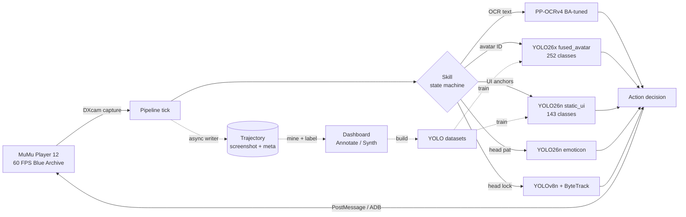
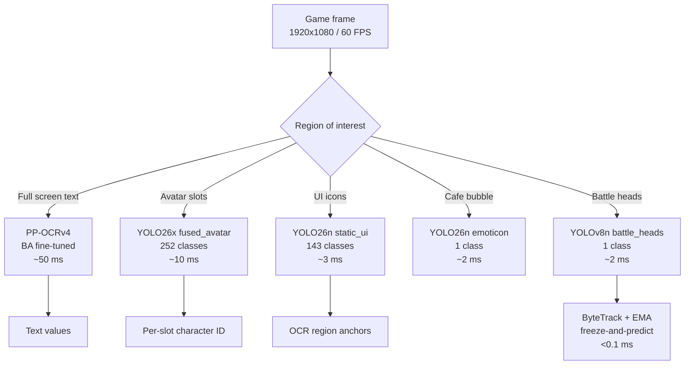
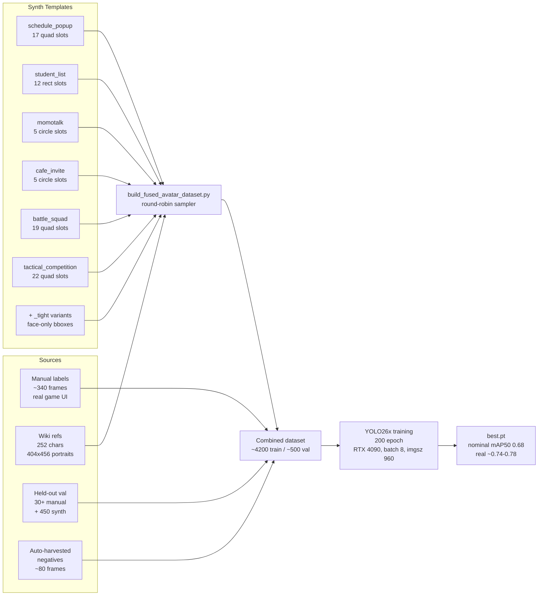
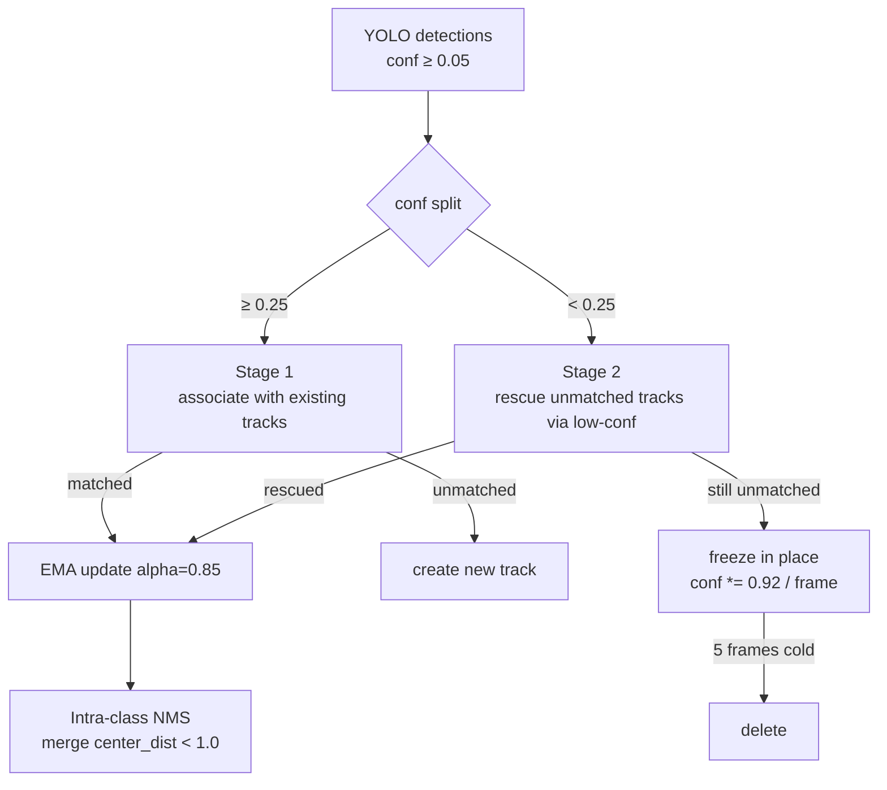
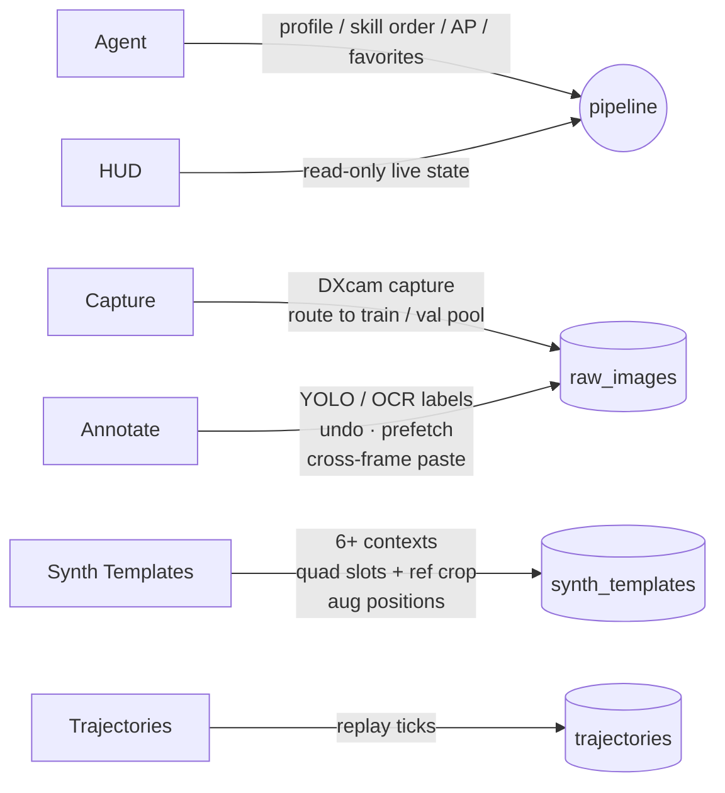

# Blue Archive Daily Assistant

Fully automated daily routine and real-time battle target lock for *Blue Archive*. Runs entirely on a local Windows machine — no cloud dependencies, no game modification.

The automation is built on a vision-first stack: a 252-class **fused YOLO26 avatar detector** identifies who is at which UI slot in a single forward pass, a fine-tuned OCR head reads numeric / text fields where templates fall short, and an explicit state machine drives 22 daily skills through MuMu Player 12 via DXcam capture + PostMessage / ADB input. A Windows-native WebView2 launcher and a feature-rich annotation dashboard make data collection and model iteration first-class workflows.

---

## At a Glance

| | |
|---|---|
| **Platform** | Windows 10 / 11, NVIDIA GPU recommended (RTX 3060+) |
| **Game runtime** | MuMu Player 12 (60 FPS cap) |
| **Daily skills** | 22 composable, ordered, dry-runnable |
| **Vision tier** | YOLO26x (252-class avatar) + YOLO26n (UI / emoticon) + YOLOv8n (battle head) |
| **OCR** | PP-OCRv4 fine-tuned on BA glyphs (+20 pp vocabulary accuracy) |
| **Battle lock** | 60-240 Hz DXcam + ByteTrack with freeze-and-predict rescue |
| **Annotation** | Dashboard with synth template editor, val cleanup tool, eval HTML report |

---

## System Overview



---

## Highlights

- **22 composable daily skills** — lobby cleanup, AP overflow guard, event farming, cafe (income / invite / head-pat), schedule assignment with favorite priority, club, MomoTalk, shop, crafting, story cleanup, bounty, arena, joint firing drill, total assault, mail, daily tasks, pass rewards, AP planning, hard-mode farming, campaign push, event boomerang.
- **Fused multi-class avatar detector (YOLO26x)** — single forward pass produces bbox + character ID across 252 classes and 6 UI contexts (schedule popup, student list, momotalk, cafe invite, battle squad, tactical competition). Replaces the older 2-stage `head_detector → avatar_cls` path.
- **Dashboard synthetic template editor** — a full visual tool to configure synth data per UI context: draw axis-aligned rect or free 4-point quad slots, interactive ref crop with slot-overlay preview, four draggable colored markers for augmentation anchor positions (Lv / star / weapon / heart), tight-face vs full bbox modes, per-context augmentation probabilities, one-click sample image swap (drag-drop or path), and live preview render with zoom + pan modal.
- **Round-robin synthesis** — the build script draws characters from a per-context shuffled pool, so every character appears in every context the configured number of times (no rare-class starvation).
- **OCR fine-tuned for BA** — PP-OCRv4 base re-trained on game crops + augmented synthetic text, delivering a 20-point absolute vocabulary-accuracy gain. The output `ba_rec.onnx` loads automatically at server boot.
- **Real-time battle head lock** — DXcam capture, YOLOv8n single-class head detection, ByteTrack with freeze-and-predict tracking, rendered to a Win32 layered overlay. Tuned for the 60 FPS MuMu cap.
- **Asynchronous trajectory writer** — each tick's screenshot and metadata are enqueued and flushed on a background thread, removing 10–50 ms of per-tick disk I/O from the perception loop.
- **Dedicated validation pools** — Capture page routes frames to `train` runs or to held-out `_val_<purpose>/frames/`; build scripts honor these so rare-class samples are never stolen from training. Synthetic val data is generated alongside manual val for stable mAP measurement.
- **Eval feedback loop** — per-frame HTML report with bbox overlays, wrong-class / extra-pred / miss buckets, and a `val_label_cleanup.py` helper that finds noisy GT labels by disagreement with the trained model.
- **Windows launcher** — .NET 8 + WebView2; double-click `GameSecretaryApp.exe` and the pipeline + dashboard come up.

---

## Vision Stack



| Tier | Component | Purpose | Latency |
|---|---|---|---|
| Primary text | PP-OCRv4 BA-tuned | Full-screen CN / EN / JP text | ~50 ms |
| Primary template | `cv2.matchTemplate` | Stable button / red-dot matching | <1 ms |
| Primary color | HSV pixel analysis | Room occupancy, button enabled, checkmarks | <1 ms |
| Avatar ID | **YOLO26x `fused_avatar_yolo26x`** | 252-class joint bbox + character ID across 6 UI contexts | ~10 ms |
| UI anchors | YOLO26n `static_ui_v4` | 143-class UI icons / popups / cards / coin badges for OCR region anchoring | ~3 ms |
| Cafe fallback | YOLO26n `emoticon_yolo26n` | Head-pat bubble when templates miss | ~2 ms |
| Battle lock | YOLOv8n `battle_heads.pt` | Single-class head detection at 60+ FPS | ~2 ms |
| Tracking | ByteTrack + EMA | Track association with freeze-and-predict rescue | <0.1 ms |

The daily pipeline reaches for templates and HSV decisions where they are cheap and exact; YOLO26 models are layered in for sub-problems templates cannot solve at scale (open-set character ID, sparse UI icons, multi-context avatar detection). Battle lock stays on the smaller YOLOv8n for headroom.

---

## Fused Avatar Detector

The 252-class fused detector is the core vision component. Training data flow:



### Synth template parameters per context

```json
{
  "context": "schedule_popup",
  "sample_image": "samples/schedule_popup.jpg",
  "image_size": [2404, 1341],
  "slot_rects_norm": [
    {"x1": 0.122, "y1": 0.358, "x2": 0.166, "y2": 0.431,
     "quad": [{"x":0.122,"y":0.358}, {"x":0.166,"y":0.358},
              {"x":0.159,"y":0.431}, {"x":0.116,"y":0.431}]}
  ],
  "ref_transform": {
    "crop_n": {"x1":0.10, "y1":0.00, "x2":0.90, "y2":0.55},
    "shape": "square",
    "scale": 1.0,
    "aug_positions": {
      "lv":     {"x": 0.05, "y": 0.15},
      "star":   {"x": 0.10, "y": 0.10},
      "weapon": {"x": 0.85, "y": 0.85},
      "heart":  {"x": 0.85, "y": 0.85}
    }
  },
  "augmentation": {
    "ui_overlay_prob": 0.5,
    "ui_components": {"lv_text":0.5,"star":0.3,"weapon_icon":0.4,"heart":0.2,"alpha_dim":0.25},
    "border_ablation_prob": 0.4
  },
  "synth_count": 297,
  "bbox_mode": "full",
  "use_for": "train"
}
```

### Training history

| Iteration | Model | Epochs | Aug profile | Notes | mAP50 (nominal) |
|---|---|---|---|---|---|
| v1 | YOLO26m | 168 (early stop) | static_ui-detected slots, no UI overlay | 113-class ref coverage | 0.597 |
| v2 | YOLO26x | 134 (early stop) | Same as v1, larger model | Capacity probe | 0.617 |
| **v3** | YOLO26x | 200 (patience=0) | **Template-driven 6 contexts**, UI overlay aug, mosaic 0.7 + mixup 0.10 + copy_paste 0.10, dropout 0.1 | **First template-editor run.** Overfit signature in epoch 130+ (val cls_loss climbed while train kept dropping). | **0.6803** (best ep124) |
| **v4** | YOLO26x | 100 (patience 30) | Warm-start from v3 best, mosaic 0.3, **mixup 0**, **copy_paste 0**, dropout 0, lr0 0.003, +tight-face variants, +synth val | Targeted at battle / tactical contexts where v3 plateaued | In training |

### v3 → v4 lessons baked into config

- **mixup / copy_paste are toxic for fine-grained 252-class classification.** They blend identity features and degrade val mAP even when train loss keeps falling. Removed in v4.
- **Mosaic 0.7 is too aggressive for a 60M-param model on 3.6 k train frames.** Lowered to 0.3.
- **Heavy regularization (`weight_decay=0.001`, `dropout=0.1`) does not rescue an over-augmented training distribution.** Lowered back to defaults.
- **`patience=0` ran the schedule fully but the best mAP came at ep 124; remaining 76 epochs traded peak accuracy for over-fit.** v4 uses `patience=30` so training stops once the plateau lasts that long.
- **Warm-starting from v3 `best.pt` saves ~50% wall-clock** and preserves the genuinely useful character-identity features the backbone learned.

### Evaluation discipline

`scripts/eval_fused_avatar_report.py` produces a per-frame HTML with bbox overlays sorted by recall. Recent fixes:

- **Confidence-aware GT ↔ pred matching** (was IoU-greedy; NMS-free duplicates could steal matches from the real high-conf prediction).
- **Separate wrong-class / extra-pred / miss buckets**, surfaced in `scripts/val_label_cleanup.py` so noisy manual labels can be found by model-disagreement.
- **IoU threshold defaults to 0.5** but can be lowered (`--iou-thr 0.3`) for context where pixel-perfect localization is not the goal.

A typical v3 review cycle on the 49 manual val frames surfaced ~14 cases where the model was actually correct and the manual label was wrong / missing — pushing the real recall ~10 pp above the nominal number. This is now a standard step before drawing any conclusions from a freshly trained model.

---

## Skill Matrix

| Skill | Function | Detection stack | Notes |
|---|---|---|---|
| Lobby | Popup / announcement / notification cleanup, sign-in | OCR + templates | Handles update banners and `TOUCH TO START` |
| AP overflow guard | Dumps AP via event farming when AP ≥ 900 | OCR numeric | Prevents cafe-settlement deadlock |
| EventActivity | Event story → mission → challenge → farming + shop | OCR + banner template + state machine | Per-rotation `auto_YYYYMMDD` progress bucket; story-tab smart-skip; direct-sortie for mission, quick-edit reserved for farming rate-up |
| EventFarming | Normal / Hard / quest-type sweeps | OCR + state machine | `event_max_rounds` + `event_ap_reserve` budget |
| Cafe | Income collection, invitation tickets, head-pat | Template + YOLO26n emoticon (fallback) | 1F left-to-right, 2F right-to-left |
| Schedule | Room assignment with favorite priority | OCR + `AvatarMatcher` + (in-rollout) `fused_avatar_yolo26x` | Region tuner on canvas; tuned `STAGE2_TOP_K=15` |
| Club | AP collection | OCR | |
| MomoTalk | Auto-reply to unread threads | OCR + state machine | Processes by unread count; auto-dialog / story skip |
| Shop | Free daily + affordable purchases | OCR + state machine | Detects completion / refresh states |
| Craft | Claim finished and queue quick craft | OCR + state machine | |
| StoryCleanup | Main / group / mini stories | OCR + state machine | Menu-driven skip with formation handling |
| Bounty | Highest-difficulty sweep | OCR + state machine | Rotates three branches; ticket recheck |
| Arena | Reward claim + auto-battle | OCR + state machine | Cooldown wait, best-opponent selection |
| JointFiringDrill / TotalAssault | Auto-participation | OCR + state machine | |
| Mail / DailyTasks / PassReward | One-click claim | OCR | |
| ApPlanning | Free-AP + purchase strategy | OCR + numeric | Configurable purchase cap |
| HardFarming / CampaignPush | Stage-specific / fallback sweeps | OCR + state machine | |
| BattleOverlay | Live head-box lock | YOLOv8n + ByteTrack | DXcam + Win32 transparent overlay, tuned for 60 FPS source |

---

## Battle Lock: ByteTrack with Freeze-and-Predict



The freeze-and-predict step is the difference between “loses lock the moment a VFX flash hides the head” and “rides through the flash with a frozen anchor and re-acquires the moment the head reappears”.

---

## Dashboard



- **Home (Agent)** — profile switching, skill ordering, AP / event budgets, favorite-character selection, dry-run toggle.
- **HUD** — live pipeline state (current skill, sub-state, tick count, AP, last action reason).
- **Capture** — DXcam screen capture with split routing (`Train (new run_*)` vs `Val (held-out pool)`) and a Purpose selector (`Fused Avatar` → `_val_fused/frames/`, `Static UI` → `_val_static_ui/frames/`). Live destination hint.
- **Annotate** — YOLO / OCR labeling workspace, hardened for long sessions:
  - Shapes: rectangles, ellipses, polygons; right-drag to draw on Windows pointer events.
  - **Undo / Redo**: `Ctrl+Z` / `Ctrl+Y` (or `Ctrl+Shift+Z`) with per-frame independent 50-step history. Snapshots at every atomic op (resize / move / rotate / vertex drag / class change / paste / Florence-add).
  - **Cross-frame paste**: `Shift+V` clones the **previous frame's** labels onto the current one (wraps around). `Shift+P` opens a picker modal — filter / arrow-keys / Enter to choose **any already-labeled frame** as the source (sorted by box count). Both go through history so `Ctrl+Z` reverts cleanly.
  - **Image cache & prefetch**: LRU cache (cap 8) keeps recent frames decoded; loading a frame triggers async prefetch of its neighbors → 0-latency `A` / `D` paging.
  - **Loss-proof saves**: `beforeunload` guard blocks reload / tab-close while edits are unsaved; `annAutoSave` `await`s the POST before navigation (race-free dirty clear via post-send re-serialization); a shared in-flight promise de-dupes concurrent `Save / Next / Ctrl+S` mashes into a single POST. Save failures surface as right-corner toasts and keep `dirty` so the next attempt re-tries.
  - **Find by class**: search box accepts class idx or name, lists every frame containing that class.
  - Dataset dropdown grouped into Validation Pools / Recordings / Trajectories.
- **Synth Templates (S)** — the heart of training data generation. Per-context visual slot editor with axis-aligned rect or free 4-point quad slots, interactive ref crop with slot-overlay preview, four draggable colored markers for augmentation anchor positions (Lv / star / weapon / heart), tight-face vs full bbox modes, per-context augmentation probabilities, fullscreen preview modal with zoom + pan + dice (random characters).
- **Trajectories** — replay of historical runs (screenshot, OCR, YOLO, action, reason) per tick.

---

## OCR Fine-Tuning

PP-OCRv4 was re-trained on Blue Archive mixed-script text (Traditional / Simplified Chinese, English, Japanese):

| Metric | Default PP-OCRv3 | BA fine-tuned | Δ |
|---|---|---|---|
| Vocabulary exact match | 35.8% | 55.8% | **+20.0** |
| Full-sample exact match | 19.2% | 20.8% | +1.6 |

The five-step pipeline under `scripts/ocr_training/` crops from trajectories, synthesises augmented samples, trains, exports to ONNX, and evaluates. Output `data/ocr_model/ba_rec.onnx` is loaded automatically when the server starts.

---

## Quick Start

### Requirements

- Windows 10 or 11
- Python 3.11+
- [MuMu Player 12](https://mumu.163.com/) running Blue Archive
- NVIDIA GPU (RTX 3060 or better for battle lock; daily pipeline is CPU-bound)

### Install

```powershell
git clone https://github.com/C0k11/blue-archive-assistant.git
cd blue-archive-assistant
pip install -r requirements.txt
```

### Run the daily pipeline

Option 1 — Windows launcher (recommended): download `GameSecretaryApp.exe` from [Releases](https://github.com/C0k11/blue-archive-assistant/releases), double-click, the launcher boots `uvicorn` and opens the dashboard in WebView2.

Option 2 — Terminal:

```powershell
py -m uvicorn server.app:app --host 127.0.0.1 --port 8000
# then open http://127.0.0.1:8000/dashboard.html
```

Option 3 — Headless:

```powershell
py mumu_runner.py
```

### Battle-lock demo

```powershell
py scripts/battle_overlay_demo.py --fps 240 --conf 0.05
```

### Train a fused avatar model from scratch

```powershell
# 1. Configure synth templates (dashboard → S tab)
# 2. Build dataset
py scripts/build_fused_avatar_dataset.py 2>&1 | tee build.log

# 3. Train
py scripts/train_yolo26.py fused_avatar_26x_v4 2>&1 | tee train.log

# 4. Eval
py scripts/eval_fused_avatar_report.py
# Open data/yolo_datasets/fused_avatar_eval.html

# 5. Optional: review noisy val labels
py scripts/val_label_cleanup.py
# Open _val_cleanup.html
```

---

## Performance Notes

- Trajectory writes are asynchronous: `brain/pipeline.py` drains a bounded `Queue(maxsize=64)` on a background thread, removing 10–50 ms of per-tick disk I/O. JSON uses compact separators (~35% smaller).
- Avatar matching caches resize results per `(name, h, w)` and circular masks per `(h, w)` in `vision/avatar_matcher.py`. Two-stage pipeline (HSV histogram prefilter → masked `matchTemplate` on top-K) defaults to `STAGE2_TOP_K=15` — faster and more accurate than the original 40 because it trims look-alike non-favourite distractors.
- OCR results are cached within a single tick so multiple `find_text` calls share one OCR invocation.
- YOLO is lazily imported so the daily pipeline does not pay the load cost. Each model file is loaded on first use; together the four active YOLO26 weights fit under 200 MB of VRAM.
- Build scripts are intentionally destructive (`shutil.rmtree(OUT_ROOT)` on emit) — do not invoke them while a training run is reading the same dataset, or worker `__getitem__` will raise `FileNotFoundError`.

---

## Repository Layout

```
ai-game-secretary/
├── brain/                       # Skill scheduler + skills
│   ├── pipeline.py              # global interceptors, async trajectory writer
│   └── skills/
├── vision/                      # OCR, avatar matcher, YOLO wrappers
├── server/                      # FastAPI app + dashboard HTML
│   ├── app.py
│   └── dashboard.html
├── scripts/
│   ├── build_fused_avatar_dataset.py   # template-driven synth + manual + neg
│   ├── train_yolo26.py                 # per-config training entry
│   ├── eval_fused_avatar_report.py     # HTML eval report
│   ├── val_label_cleanup.py            # find noisy GT
│   ├── verify_class_alignment.py       # ref ↔ master audit
│   ├── fix_class_alignment.py          # one-shot master cleanup
│   ├── mine_hard_examples.py           # data-flywheel candidate picker
│   └── ocr_training/                   # PP-OCRv4 fine-tune pipeline
├── data/
│   ├── synth_templates/                # per-context JSON (slot rects, aug, bbox_mode, use_for)
│   ├── captures/角色头像/             # 252 wiki portrait refs (404x456)
│   ├── student_name_map.json           # 261 CN→EN
│   └── student_name_map_extension.json # +100 manual + corrections
├── windows_app/                 # .NET 8 WebView2 launcher source
└── README.md
```

External (gitignored) — under `D:/Project/ml_cache/`:

```
ml_cache/
├── models/yolo/
│   ├── runs/fused_avatar_yolo26x/      # v3 best.pt + plots
│   ├── runs/fused_avatar_yolo26x_v4/   # v4 in progress
│   └── dataset/fused_avatar_v1/        # train/val frames + labels + data.yaml
└── huggingface/                        # HF cache
```

---

## What's Not Here (Yet)

- **3D battle character recognition** — Open question. The 252-class model is trained on 2D wiki refs + UI slots; recognizing the 3D in-game model would need either targeted 3D screenshots (~50–200 per character) or a face-embedding pipeline. Feasibility analysis lives in `memory/yolo_migration.md`.
- **Battle multi-class detector** — Planned upgrade from the YOLOv8n single-class head detector to a YOLO26m/x detector covering player students + ~50 enemy types + ~30 bosses. 60 FPS budget makes 26m at imgsz=640 a strong fit; TensorRT FP16 export is the deployment path.
- **Static UI auto-labeling at scale** — The current `static_ui_v4` (mAP50 = 0.339) is data-bound. The plan: hybrid of `cv2.matchTemplate` for stable buttons (yellow confirm, X, red-dot, currency icons) and AssetStudio-extracted UI textures pasted by the existing synth pipeline.

---

## License & Disclaimer

Personal use / education only. No game files are redistributed; assets stay in your own MuMu installation. Not affiliated with Yostar / Nexon / Bilibili / NetEase.
